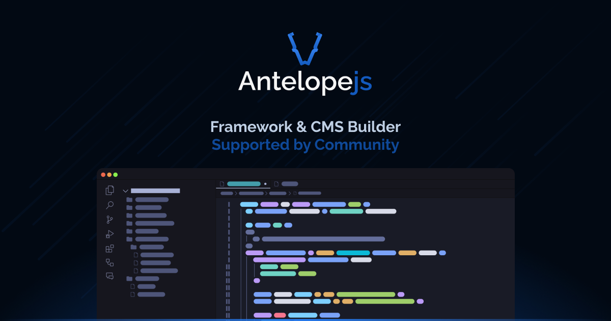

# 

AntelopeJS is a modular Node.js framework for building applications from small,
independent modules connected through versioned interfaces.

## Get started

- Read the [framework documentation](https://antelopejs.com/).
- Explore the [`@antelopejs/core`](https://github.com/AntelopeJS/antelopejs)
  runtime and CLI.
- Browse the public packages in this organization.
- Join the [Discord community](https://discord.com/invite/yS53x6FXQj).

## Contributing and security

Contributions are welcome. Read our [contribution guidelines](../CONTRIBUTING.md)
before opening a pull request. Report security vulnerabilities privately by
following our [security policy](../SECURITY.md).

AntelopeJS projects are generally released under the Apache License 2.0. Refer
to each repository for its definitive license and support status.
